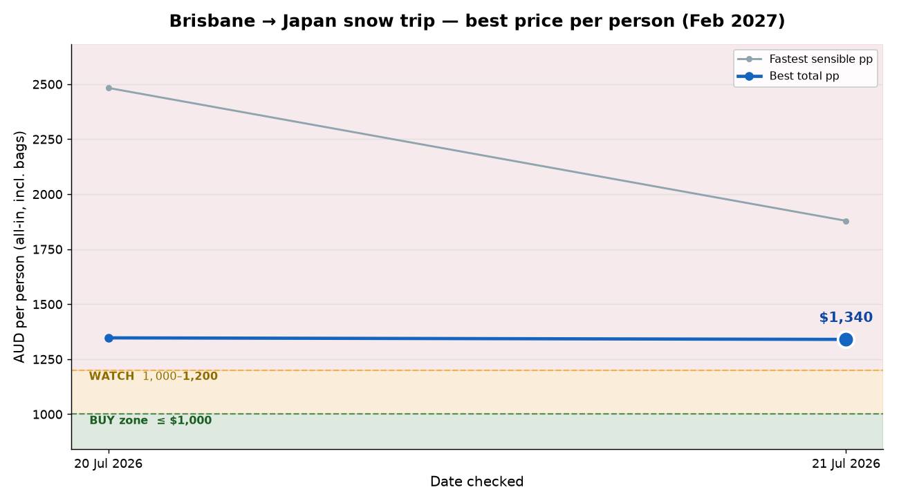

# Japan snow trip — daily flight watch (21 Jul 2026)

## 📋 Today's snapshot

🔴 **HOLD — nothing to book yet.** The cheapest all-in way to get all four of you to the snow and home again is **$1,340 per person ($5,360 for the four lads)**, and that's still a fair way over where we'd want to pull the trigger. It nudged **down $7** since yesterday (was $1,347) — basically flat, no dip worth chasing. No airline sale could be confirmed today (both the Jetstar and Qantas deal pages blocked us — see nerd notes), so there's nothing time-sensitive. Sit tight; I'll keep watching daily.

📈 Since yesterday: ↓ $7

📉 Since last week: no week of history yet (only two days logged)

🎯 Distance from buy target ($1,000): **$340 above**

## ✈️ Trip options

All prices are per person in AUD, **all-in** — every flight including the Sapporo⇄Tokyo hops, and 1 checked 20kg bag each way. "All 4 lads" is the whole crew.

| Option | Getting there | Getting home | Total pp | All 4 lads | Door-to-door | Worth knowing |
|---|---|---|---|---|---|---|
| **A — Cheapest** | 🛫 Dep Brisbane (BNE) Tue 2 Feb 2:40pm → 🛬 lands Tokyo (NRT) Wed 3 Feb 8:00pm *(via Port Moresby)*, then short hop up to Sapporo | 🛫 Dep Tokyo (NRT) Wed 17 Feb 9:40pm → 🛬 lands Brisbane (BNE) Thu 18 Feb 9:40am *(via Port Moresby)* | **$1,340** | **$5,360** | there ~29h · home 11h | long haul: 29h out via Port Moresby — brutal; price incl. both Sapporo hops |
| **B — Best value** | 🛫 Dep Brisbane (BNE) Tue 2 Feb 10:30am → 🛬 lands Tokyo (NRT) Tue 2 Feb 6:25pm *(Jetstar nonstop)*, then hop up to Sapporo next morning | 🛫 Dep Tokyo (NRT) Wed 17 Feb 9:40pm → 🛬 lands Brisbane (BNE) Thu 18 Feb 9:40am *(via Port Moresby)* | **$1,557** | **$6,228** | there 7h55m · home 11h | nonstop the way over (easy day), cheap via-Port-Moresby home; best comfort-per-dollar |
| **C — Fastest sensible** | 🛫 Dep Brisbane (BNE) Tue 2 Feb 10:30am → 🛬 lands Tokyo (NRT) Tue 2 Feb 6:25pm *(Jetstar nonstop)*, then hop up to Sapporo next morning | 🛫 Dep Tokyo (NRT) Wed 17 Feb 8:55pm → 🛬 lands Brisbane (BNE) Thu 18 Feb 6:45am *(Jetstar nonstop)* | **$1,879** | **$7,516** | there 7h55m · home 8h50m | nonstop both ways — quickest door-to-door, no dodgy layovers |

*Qantas Sydney–Sapporo direct (QF107): priced today at $1,664pp for the Sapporo leg alone (dep Sydney 9:05am → lands Sapporo (CTS) 6:00pm, 8h55m nonstop). Add a Brisbane–Sydney connection and a home-from-Tokyo leg and a Qantas-via-Sydney trip lands around $2,600pp — genuinely the fastest way physically into Sapporo, but far too dear to contend right now.*

## 🗓️ Option A itinerary (Cheapest — $1,340pp)

Hire car picked up and dropped at Sapporo (CTS). Ski base: **Rusutsu**.

| Day | Date | Location | Plan |
|---|---|---|---|
| Depart | Tue 2 Feb | ✈️ Brisbane → | Fly out BNE 2:40pm, overnight via Port Moresby |
| 1 | Wed 3 Feb | Tokyo (NRT) | Land Tokyo 8:00pm — airport hotel overnight |
| 2 | Thu 4 Feb | Sapporo | Morning hop to Sapporo, pick up hire car, Snow Festival evening stroll |
| 3 | Fri 5 Feb | Sapporo | Snow Festival day 1 (full) |
| 4 | Sat 6 Feb | Sapporo / Otaru | Snow Festival day 2 (full) + Otaru canal evening |
| 5 | Sun 7 Feb | Rusutsu | Drive to Rusutsu · Ski day 1 — Isaac AM beginner lesson, lads ride |
| 6 | Mon 8 Feb | Rusutsu | Ski day 2 — Isaac AM lesson, lads ride powder |
| 7 | Tue 9 Feb | Rusutsu | Ski day 3 — Rusutsu bowls (Niseko day-trip option) |
| 8 | Wed 10 Feb | Rusutsu | Ski day 4 — powder laps |
| 9 | Thu 11 Feb | Noboribetsu | Spare Hokkaido day — onsen soak / extra ride |
| 10 | Fri 12 Feb | Sapporo | Drive back to Sapporo, drop hire car (CTS), Susukino night out |
| 11 | Sat 13 Feb | Tokyo | Fly Sapporo → Tokyo · Tokyo day 1 (Shibuya/Shinjuku) |
| 12 | Sun 14 Feb | Tokyo | Tokyo day 2 (Tsukiji, Asakusa) |
| 13 | Mon 15 Feb | Tokyo | Tokyo day 3 (Nikko day-trip or shopping) |
| 14 | Tue 16 Feb | Tokyo | Tokyo day 4 *(droppable)* — Akihabara / last bits |
| Home | Wed 17 Feb | ✈️ Tokyo → Brisbane | Fly home NRT 9:40pm via Port Moresby |
| Land | Thu 18 Feb | Brisbane (BNE) | Land Brisbane 9:40am |

## 🗓️ Option B itinerary (Best value — $1,557pp)

Same ground plan and ski base (Rusutsu); nonstop out means you land a day earlier, so day 2 is a relaxed Sapporo settle-in before the festival opens.

| Day | Date | Location | Plan |
|---|---|---|---|
| 1 | Tue 2 Feb | ✈️ Brisbane → Tokyo | Fly BNE 10:30am nonstop, land Tokyo 6:25pm, airport hotel |
| 2 | Wed 3 Feb | Sapporo | Morning hop to Sapporo, pick up hire car, settle in |
| 3 | Thu 4 Feb | Sapporo | Snow Festival day 1 (full) |
| 4 | Fri 5 Feb | Sapporo / Otaru | Snow Festival day 2 (full) + Otaru canal evening |
| 5 | Sat 6 Feb | Rusutsu | Drive to Rusutsu · Ski day 1 — Isaac AM beginner lesson, lads ride |
| 6 | Sun 7 Feb | Rusutsu | Ski day 2 — Isaac AM lesson, lads ride powder |
| 7 | Mon 8 Feb | Rusutsu | Ski day 3 — Rusutsu bowls (Niseko day-trip option) |
| 8 | Tue 9 Feb | Rusutsu | Ski day 4 — powder laps |
| 9 | Wed 10 Feb | Noboribetsu | Spare Hokkaido day — onsen soak / extra ride |
| 10 | Thu 11 Feb | Sapporo | Drive back to Sapporo, drop hire car (CTS), Susukino night out |
| 11 | Fri 12 Feb | Sapporo | Extra Sapporo day (markets, snow park) |
| 12 | Sat 13 Feb | Tokyo | Fly Sapporo → Tokyo · Tokyo day 1 |
| 13 | Sun 14 Feb | Tokyo | Tokyo day 2 |
| 14 | Mon 15 Feb | Tokyo | Tokyo day 3 *(droppable)* |
| Home | Wed 17 Feb | ✈️ Tokyo → Brisbane | Fly home NRT 9:40pm via Port Moresby |
| Land | Thu 18 Feb | Brisbane (BNE) | Land Brisbane 9:40am |

## 🗓️ Option C itinerary (Fastest sensible — $1,879pp)

Identical to Option B on the ground — the only change is the home flight is the Jetstar nonstop (lands Brisbane 6:45am, no Port Moresby stop).

| Day | Date | Location | Plan |
|---|---|---|---|
| 1 | Tue 2 Feb | ✈️ Brisbane → Tokyo | Fly BNE 10:30am nonstop, land Tokyo 6:25pm, airport hotel |
| 2 | Wed 3 Feb | Sapporo | Morning hop to Sapporo, pick up hire car, settle in |
| 3 | Thu 4 Feb | Sapporo | Snow Festival day 1 (full) |
| 4 | Fri 5 Feb | Sapporo / Otaru | Snow Festival day 2 (full) + Otaru canal evening |
| 5 | Sat 6 Feb | Rusutsu | Drive to Rusutsu · Ski day 1 — Isaac AM beginner lesson, lads ride |
| 6 | Sun 7 Feb | Rusutsu | Ski day 2 — Isaac AM lesson, lads ride powder |
| 7 | Mon 8 Feb | Rusutsu | Ski day 3 — Rusutsu bowls (Niseko day-trip option) |
| 8 | Tue 9 Feb | Rusutsu | Ski day 4 — powder laps |
| 9 | Wed 10 Feb | Noboribetsu | Spare Hokkaido day — onsen soak / extra ride |
| 10 | Thu 11 Feb | Sapporo | Drive back to Sapporo, drop hire car (CTS), Susukino night out |
| 11 | Fri 12 Feb | Sapporo | Extra Sapporo day |
| 12 | Sat 13 Feb | Tokyo | Fly Sapporo → Tokyo · Tokyo day 1 |
| 13 | Sun 14 Feb | Tokyo | Tokyo day 2 |
| 14 | Mon 15 Feb | Tokyo | Tokyo day 3 *(droppable)* |
| Home | Wed 17 Feb | ✈️ Tokyo → Brisbane | Fly home NRT 8:55pm nonstop |
| Land | Thu 18 Feb | Brisbane (BNE) | Land Brisbane 6:45am |

## 🔧 Nerd notes

- Data: Kiwi.com connector for all fares (priced in AUD with 1 checked bag each way, so bag fees are already in every total); web search for the sale sweep.
- Sale check: **no live Japan sale could be verified today** — both the Jetstar deals page and the Qantas "flights to Japan" page returned **403 Forbidden**, and search results only surfaced past 2026 sales. Treating any current-sale talk as unverified rumour.
- Cheapest structure is the Brisbane⇄Tokyo Air Niugini return via Port Moresby ($1,114pp) plus the two cheap Sapporo hops ($100 + $126); the 29h outbound is the price of that saving.
- Via-China carriers (China Southern / China Eastern) were included in the search but returned no competitive Feb-2027 fares to Hokkaido, so none made the table.
- QF107 Sydney–Sapporo direct priced fine ($1,664pp one-way) — logged but far too expensive to contend.
- CSV row for 21 Jul appended, chart.png / chart-email.png regenerated, this report written; all committed to the repo.
